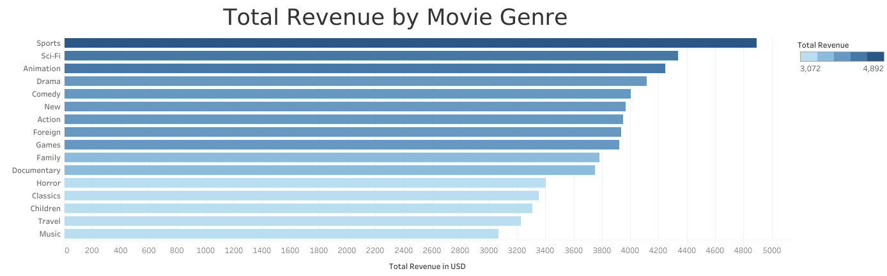

# CF3Rockbuster
###### This project was completed as a requirement for the Data Analytics Program by CareerFoundry
## Project Overview
###### "Rockbuster Stealth LLC is a movie rental company that used to have stores around the world. Facing stiff competition from streaming services such as Netflix and Amazon Prime, the Rockbuster Stealth management team is planning to use its existing movie licenses to launch an online video rental service in order to stay competitive.
###### You’ve been hired as a data analyst by Rockbuster Stealth’s business intelligence (BI) department to help with the launch strategy for the new online video service. The BI department helps other departments, from inventory to customer insights, with data-related queries. Your first task is to load all of Rockbuster’s data into a relational database management system (RDBMS). Then, you’ll use SQL to analyze the data and answer any ad-hoc business questions that other departments may have."

##### The SQL queries used for this project can be found in the "Queries" folder

## Key Questions and Objectives
###### Which movies contributed the most/least to revenue gain?
###### What was the average rental duration for all videos?
###### Which countries are Rockbuster customers based in?
###### Where are customers with a high lifetime value based?
###### Do sales figures vary between geographic regions?

## Insights

###### 1. "Sports" genre ranks 1st in both revenue earned and number of films in Rockbuster's inventory.
###### 2. "Sci-Fi" genre ranks 2nd in revenue earned, despite ranking 9th in total number of films in inventory.
###### 3. "Foreign" and "Family" genres rank 2nd and 3rd in total number of films, respectively, but only rank 8th and 10th in total revenue earned.

###### [View the Tableau Graph for Total Revenue by Movie Genre](https://public.tableau.com/views/Task3_10Updated/TotalRevenuebyMovieGenre?:language=en-US&:sid=&:redirect=auth&:display_count=n&:origin=viz_share_link)
###### [View the Tableau Graph for Number of Films by Movie Genre](https://public.tableau.com/views/Task3_10Updated/No_ofFilmsperGenre?:language=en-US&:sid=&:redirect=auth&:display_count=n&:origin=viz_share_link)

###### 4. Films across all genres rent for an average of 4.5-5.5 days, with films in the "New" genre having the lowest average of number of days rented
###### [View the Tableau Graph for Average Rental Duration by Movie Genre](https://public.tableau.com/views/Task3_10Updated/MovieGenrebyRentalDuration?:language=en-US&:sid=&:redirect=auth&:display_count=n&:origin=viz_share_link)

###### 5. Countries with high populations tend to have higher number of Rockbuster customers (the top 3 countries by population are also have the most Rockbuster customers)

###### [View the Tableau Graph for Location of Rockbuster Customers](https://public.tableau.com/views/Task3_10Updated/MapWhereAretheCustomers?:language=en-US&:sid=&:redirect=auth&:display_count=n&:origin=viz_share_link)

## Recommendations
###### Increase the number of "Sci-Fi" and "Sports" films in inventory; decrease the number of "Foreign" and "Family" genres.
###### Conduct further research to determine if "Sci-Fi" films should be rented at a higher price and if "Foreign" and "Family" films should be rented at a lower price.
###### Offer shorter rental periods for "New" films, particularly for films that have recently left theaters; further research can determine the most effective way to market this rental option
###### Emphasize marketing strategies in countries with high populations; further research is needed to see if other factors besides population determine Rockbuster's popularity in a country/region

## Data
##### The dataset contains the following data tables
###### Payment
###### Rental
###### Customer
###### Store
###### film_actor
###### Inventory
###### film_category
###### Staff
###### Actor
###### Film
###### Category
###### Address
###### Language
###### City
###### Country
##### Downloadable link to dataset:
http://www.postgresqltutorial.com/wp-content/uploads/2019/05/dvdrental.zip

## Visualizations
##### Link to Tableau Visualizations (on Tableau Public)
https://public.tableau.com/app/profile/tristan.savella/viz/Task3_10Updated/Top14byCustomerCount

## Tools Used
###### PostgreSQL
###### Tableau
###### Excel
